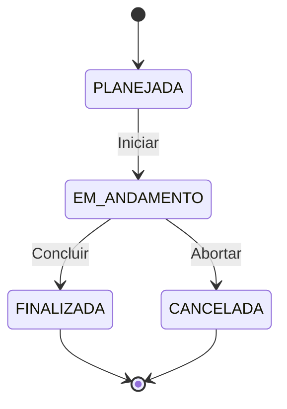

# ConstructFlow

> Plataforma full-stack para gestão de obras e documentos, com API robusta em Spring Boot e interface reativa em React.

## Visão Geral
ConstructFlow simula um ecossistema real de construção civil: cadastro de usuários com permissões granulares, controle de status de obras e gestão de documentos vinculados. O projeto foca em demonstrar excelência em **camadas de API**, **regras de negócio complexas** e **segurança avançada**.

### Destaques Técnicos
* **Segurança:** Autenticação JWT (expiração de 1h) com senhas criptografadas via BCrypt.
* **Arquitetura:** Separação clara entre Entidades e DTOs para proteção da camada de dados.
* **Tratamento de Erros:** Respostas de erro padronizadas (RFC 7807) com `@ControllerAdvice`.
* **Validação:** Entrada de dados rigorosa com Bean Validation.

---

## Stack Tecnológica

* **Backend:** Java 23, Spring Boot 3.4, Spring Security, Spring Data JPA, Hibernate, PostgreSQL, Lombok, JJWT.
* **Frontend:** React 19, Vite 7, ESLint.
* **Infra local:** PostgreSQL, Maven.

---

## Modelo de Domínio

### Entidades e Papéis
* **Usuário:** Nome, email, senha (hash), papel (`ADMIN`, `ENGENHEIRO`, `BACKOFFICE`, `CAMPO`).
* **Obra:** Nome, endereço, status, responsável (Engenheiro), usuários vinculados.
* **Documento:** Nome, tipo, status, data de upload, obra vinculada.

### Tipos e Status
* **Tipos de Documento:** `ORCAMENTO`, `CONTRATO`, `NOTA_FISCAL`, `PROJETO`, `RELATORIO`, `OUTRO`.
* **Status de Documento:** `PENDENTE`, `APROVADO`, `REPROVADO`.
* **Fluxo de Status da Obra:**

## 🔒 Regras de Negócio e Segurança

* **Acesso Público:** Apenas `POST /auth/login` e `POST /usuarios` são públicos. Todo o restante da API exige um token JWT válido.
* **Permissões de Status:** Somente o papel `ADMIN` ou o `ENGENHEIRO` definido como responsável pela obra podem alterar o seu status.
* **Vínculo Obrigatório:** O sistema valida se o responsável atribuído a uma obra possui, de fato, o papel de `ENGENHEIRO`.
* **Upload de Documentos:** Usuários com papel `CAMPO` e `ENGENHEIRO` só possuem permissão para criar documentos em obras onde estão explicitamente vinculados na base de dados.
* **Visibilidade de Listagem:**
    * `ADMIN` / `BACKOFFICE`: Possuem visão irrestrita de todos os projetos.
    * `ENGENHEIRO`: Visualiza apenas as obras que lidera tecnicamente.
    * `CAMPO`: Visualiza apenas as obras onde está alocado operacionalmente.

---

## 🛣️ Endpoints Principais

### Autenticação
* `POST /auth/login`

### Usuários
* `POST /usuarios` | `GET /usuarios` | `GET /usuarios/{id}`
* `GET /usuarios/email?email=...`
* `PATCH /usuarios/{id}` | `DELETE /usuarios/{id}`

### Obras
* `POST /obras` | `GET /obras` | `GET /obras/{id}`
* `PATCH /obras/{obraId}` | `PATCH /obras/{obraId}/status`
* `GET /obras/status/{status}` | `DELETE /obras/{obraId}`

### Documentos
* `POST /documentos` | `GET /documentos`
* `GET /documentos/{documentoId}` | `GET /documentos/obras/{obraId}`
* `PUT /documentos/{documentoId}/status` | `PUT /documentos/{documentoId}/nome`
* `DELETE /documentos/{documentoId}`

---

## 🚀 Como Executar Localmente

### Pré-requisitos
* **Java 23** (Variável `JAVA_HOME` configurada)
* **Maven 3.9+**
* **Node.js 18+** e npm
* **PostgreSQL 14+**

### Backend
1. Se estiver no IntelliJ, importe `constructflow-api/pom.xml` como Maven Project.
2. Ajuste as credenciais em `constructflow-api/src/main/resources/application.properties`:
   - `spring.datasource.url`
   - `spring.datasource.username`
   - `spring.datasource.password`
   - `jwt.secret`
3. Suba o PostgreSQL e crie o banco `constructflow`.
4. Rode:
   - `cd constructflow-api`
   - `mvn spring-boot:run`

### Frontend
1. Rode:
   - `cd constructflow-frontend`
   - `npm install`
   - `npm run dev`

## Estrutura do repositorio

constructflow-api/       # API Spring Boot
 ├── src/main/java/com/project/
 │    ├── controllers/   # Recursos da API (Endpoints)
 │    ├── dto/           # Data Transfer Objects
 │    ├── entities/      # Entidades JPA (Mapeamento de Banco)
 │    ├── exceptions/    # Handler Global de Erros
 │    ├── repositories/  # Acesso ao Banco de Dados (Spring Data)
 │    ├── security/      # Filtros JWT e Configuração de Segurança
 │    └── services/      # Camada de Regras de Negócio
constructflow-frontend/  # App React + Vite (Base UI)

## Notas de portfolio
O foco central deste projeto é a robustez do ecossistema Backend. O frontend atual é minimalista e serve como uma prova de conceito (PoC) para o consumo da API. Toda a estrutura foi desenhada para ser "production-ready", com separação clara de responsabilidades, permitindo fácil escalabilidade para novos papéis e fluxos de trabalho.

## Proximos passos
- Tela de login e dashboard com consumo real da API.
[ ] Documentação: Implementar Swagger/OpenAPI para documentação interativa.
[ ] Infraestrutura: Criar arquivo docker-compose.yml para orquestração simplificada.
[ ] Storage: Adicionar suporte a upload real de arquivos (Integração com AWS S3 ou MinIO).
[ ] Qualidade: Ampliar a cobertura de testes unitários e de integração.
